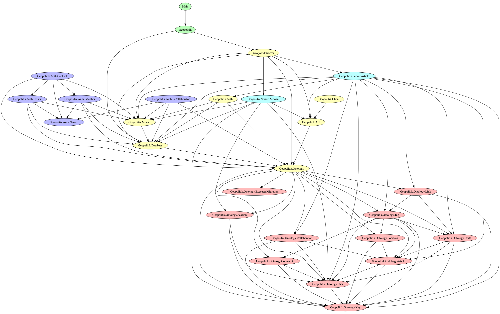

# Geopolitik

Geopolitik is a website for people to publish their articles on topics
relating to geopolitics. This can include news, culture, sports, economics,
business, geography.

## Installing/Running

To run this on mac, you need to have PostgreSQL running locally on port 5432 with a database
called "geopolitik", and you need to have the postgis extension installed, both of which are
available via brew.
```bash
export GEOPOLITIK_LOCATION=<this-folder>
stack run migrate
```
If you want to drop the various tables that this adds to that postgres database, you can run this script
and get rid of them all. 
```bash
stack run drop
```

## Architecture

This application is deeply simple and it was designed to be as such. There are 6 modules in the Haskell
library that the library consists of, and I expect it will stay that way. 

